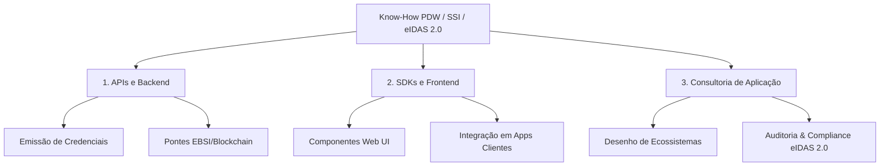

# Plano de Estratégia de Negócio & Marketing: Portuguese Digital Wallet (PDW)

Este documento foi elaborado sob a perspetiva de um **Estrategista de Negócios e Tecnologia**, integrando as valências de desenvolvimento, comunicação e marketing para posicionar a PDW não apenas como uma carteira digital académica, mas como uma **infraestrutura crítica de confiança e um motor de transformação digital soberana** para o comércio e a indústria.

---

## 1. O Conhecimento Acumulado: O Nosso Ativo Proprietário

O desenvolvimento bem-sucedido do MVP da **PDW Wallet** gerou um ativo intangível de valor incalculável para o consórcio: **know-how técnico e regulamentar profundo**. 

Não desenvolvemos apenas um software; dominamos:
*   **Identidade Auto-Soberana (SSI):** A arquitetura de chaves criptográficas geridas localmente no dispositivo do cidadão.
*   **Interoperabilidade Europeia (EBSI & eIDAS 2.0):** Alinhamento completo com os standards da Comissão Europeia (EUDI ARF) e infraestrutura de blockchain pública europeia.
*   **Triângulo de Confiança Descentralizado:** Domínio completo do fluxo entre Emissor (*Issuer*), Titular (*Holder*) e Verificador (*Verifier*).

### O Portfólio de Serviços Comercializáveis (A nossa Oferta B2B)
Este conhecimento traduz-se em três linhas de negócio estruturadas para monetização no setor privado e público:



1.  **Infraestrutura e APIs (Backend):**
    *   APIs prontas a integrar para permitir que qualquer empresa emita Credenciais Verificáveis (VCs) para os seus clientes ou colaboradores.
    *   Pontes de ligação seguras para validação na blockchain EBSI.
2.  **SDKs e Componentes Visuais (Frontend):**
    *   Componentes UI "plug-and-play" (Web Components, React/Next.js helpers) para portais de clientes ou intranets industriais.
    *   Botões padrão de interação como *"Validar com PDW"* ou *"Importar para a Wallet"* que removem a complexidade criptográfica para os programadores do cliente.
3.  **Consultoria de Aplicação (Advisory):**
    *   Acompanhamento estratégico para desenhar fluxos de trabalho adequados à regulamentação eIDAS 2.0.
    *   Desenho de arquiteturas híbridas que integram bases de dados legacy com o paradigma descentralizado da identidade auto-soberana.

---

## 2. Análise de Oportunidades de Mercado: Comércio e Indústria

> [!NOTE]
> Enquanto a **Educação** (Diplomas Digitais) é a nossa prova de conceito mais madura, o **Comércio** e a **Indústria** representam os maiores vetores de crescimento financeiro para atingir a meta de **111M€ em vendas anuais até 2027**.

### A. Setor do Comércio (Commerce & E-Commerce)
O grande desafio do comércio moderno é a **fricção no registo/checkout** e a **segurança dos dados dos clientes (RGPD)**. A PDW resolve ambos.

#### Casos de Uso Concretos:
1.  **Fidelidade Sem Fricção (Decentralized Loyalty):**
    *   Em vez de cartões de fidelização físicos ou apps individuais de cada loja, o cliente guarda os seus "cartões de cliente" como credenciais verificáveis na PDW.
    *   **Vantagem:** O retalhista não precisa de manter bases de dados gigantescas de utilizadores, reduzindo custos de conformidade e o risco de fugas de informação.
2.  **Verificação de Idade e Atributos (Selective Disclosure):**
    *   Comércio eletrónico de produtos restritos (álcool, tabaco, jogos online) exige verificação de idade. Hoje, isto exige carregar fotos do Cartão de Cidadão (alto risco de RGPD).
    *   Com a PDW, o cliente prova que *"tem mais de 18 anos"* sem partilhar o nome, foto ou data de nascimento exata. A validação é criptográfica e instantânea.
3.  **Logins e Checkouts Rápidos (One-Click Verified Checkout):**
    *   Integração do botão "Checkout Seguro com PDW". O utilizador partilha a sua morada de entrega e dados fiscais previamente verificados e guardados na wallet com apenas um QR Code.
    *   **Impacto de Negócio:** Redução da taxa de abandono do carrinho de compras e eliminação de fraude de identidade em compras online.

---

### B. Setor da Indústria (Supply Chain & Logística)
A indústria exige **rastreabilidade total, segurança no trabalho e conformidade rigorosa**. A PDW atua como o validador de competências e processos.

#### Casos de Uso Concretos:
1.  **Certificação de Operadores e Segurança Laboral (Safety Compliance):**
    *   Em indústrias pesadas, químicas ou de construção, os operadores precisam de certificações ativas (ex: licença para manobrar empilhadoras, formação em substâncias perigosas).
    *   **Solução:** O centro de formação emite uma credencial digital para a PDW do trabalhador. As máquinas ou sistemas de acesso físico (torniquetes) exigem a validação dessa credencial antes de iniciar o funcionamento.
    *   **Vantagem:** Zero acidentes por operadores não credenciados; auditoria automática e imutável para seguradoras e reguladores.
2.  **Subcontratação e Acesso a Instalações (Vendor Validation):**
    *   Grandes indústrias gerem centenas de fornecedores diários que acedem às suas fábricas. Validar se o trabalhador externo tem o seguro de acidentes de trabalho em dia é um processo burocrático manual.
    *   A PDW permite a validação instantânea e digital dessas credenciais no portal de acesso.
3. Rastreabilidade de Cadeia de Abastecimento (Farm-to-Fork / Green Transition):
    *   Credenciais de sustentabilidade, origem de matéria-prima e conformidade ambiental associadas a lotes industriais que podem ser validadas ao longo de toda a cadeia logística.

---

## 3. Direcionamento de Marketing: A Estratégia Omnichannel

Para passar do site para as redes sociais e materiais físicos, devemos traduzir a linguagem institucional de "eIDAS 2.0" para **benefícios de negócio tangíveis**.

```
    SITE INSTITUCIONAL (Âncora de Confiança)
           │
           ├─► REDES SOCIAIS (LinkedIn - Liderança de Pensamento B2B)
           │
           └─► MATERIAIS FÍSICOS (Folders B2B & Cartazes de Ponto de Contacto)
```

### A. Estratégia para Redes Sociais (Foco Absoluto no LinkedIn)
O nosso público-alvo B2B (Diretores de TI, CFOs, Diretores de Operações Industriais, Reitores) consome informação no LinkedIn. O tom deve ser **especializado, calmo ("calm-tech") e focado em dados concretos**.

#### 3 Pilares de Conteúdo para o LinkedIn:
1.  **Pilar 1: Desmistificar a Tecnologia (Educação SSI/eIDAS 2.0):**
    *   *Exemplo de Post:* "O que muda para a sua empresa com o eIDAS 2.0?"
    *   *Formato:* Carrossel (PDF) limpo, com design corporativo (verdes e navy PDW), explicando como a identidade digital vai substituir as passwords.
2.  **Pilar 2: Casos de Sucesso Reais (Foco em Resultados):**
    *   *Exemplo de Post:* "Como a Universidade do Minho reduziu em 90% o tempo de validação de diplomas com a PDW."
    *   *Formato:* Vídeo curto ou infográfico estático mostrando a redução do tempo e custos administrativos.
3.  **Pilar 3: Futuro da Indústria e do Comércio:**
    *   *Exemplo de Post:* "Indústria 4.0: Como garantir que apenas pessoal qualificado opera maquinaria crítica?"
    *   *Formato:* Artigo de opinião assinado por um dos coordenadores de I&D (ex: Miguel Marques ou Kim Peiter Jørgensen) focado no ROI de segurança.

---

### B. Estratégia para Materiais Impressos / Físicos

#### 1. O Folder Corporativo B2B (Apresentação Comercial)
O folder deve ser distribuído em feiras tecnológicas, reuniões de vendas e eventos da Agenda Blockchain.PT.
*   **Design:** Papel mate premium, uso das cores corporativas (`#006c4b` e `#1a3b5d`). Na capa, um mockup elegante da app móvel com um QR Code que aponta diretamente para o simulador interativo do site.
*   **Estrutura de Conteúdo:**
    *   **Capa:** *"Portuguese Digital Wallet. A Camada de Confiança da sua Organização."*
    *   **Interior Esquerdo (O Desafio):** *"Burocracia, fraudes de dados e RGPD complexo. O custo de gerir identidades hoje."*
    *   **Interior Direito (A Solução PDW):** Apresentação das 3 vertentes: APIs de integração rápida, SDKs frontend e consultoria especializada.
    *   **Verso:** Selos de conformidade (EBSI, eIDAS 2.0), logótipos do consórcio (TecMinho, Blockchain.PT, VOID, UMinho) e marcas de financiamento obrigatórias (PRR, NextGenerationEU).

#### 2. Cartazes (Ponto de Contacto)
Os cartazes devem ser afixados em locais estratégicos para capturar a atenção de emissores e utilizadores finais.

*   **Cartaz Universitário / Educacional (Foco no Estudante):**
    *   *Afixação:* Serviços Académicos, Associações de Estudantes, átrios das Faculdades.
    *   *Slogan Principal:* **"O teu percurso académico. No teu telemóvel. Num clique."**
    *   *Visual:* Mockup limpo da app a receber um diploma com um QR Code gigante para descarregar a app.
    *   *Subtexto:* *"Sem filas para certidões. Sem custos de emissão. Totalmente válido na União Europeia."*

*   **Cartaz Industrial / Distribuição (Foco no Operador/Segurança):**
    *   *Afixação:* Refeitórios de fábricas, salas de formação industrial, centros logísticos de parceiros.
    *   *Slogan Principal:* **"Competências validadas, operações mais seguras."**
    *   *Visual:* Diagrama simples do fluxo (Emissor de Formação -> Wallet do Operador -> Leitor da Máquina).
    *   *Subtexto:* *"O seu registo de segurança sempre consigo. Sem papéis, sem perdas, 100% digital."*

---

## 4. Plano de Ação para a Equipa: A Visão do Estrategista

Como líder da equipa, eis o roteiro de tarefas imediatas divididas por departamento para capitalizar esta oportunidade:

### 💻 Equipa de Desenvolvimento (Devs)
*   **Modularização do Frontend:** Isolar os componentes de simulação e validação (como o `InteractiveSimulator.tsx` e o `StatusBadge.tsx`) em pacotes npm internos (`@pdw/sdk-react`), facilitando a venda e integração em clientes.
*   **Criação de Sandbox de API:** Desenvolver uma página `/developers` no site com documentação clara de Swagger/OpenAPI para que programadores de empresas externas possam simular a emissão de uma credencial num ambiente de testes.

### ✍️ Equipa de Comunicação & Copywriting
*   **Tradução de Termos Técnicos:** Criar um "Dicionário de Negócios PDW" que substitua termos como *"Identificadores Descentralizados (DIDs)"* por *"Chave Digital de Segurança Única"*, facilitando a compreensão para decisores comerciais.
*   **Redação dos Estudos de Caso (Case Studies):** Estruturar em PDF dinâmico o caso dos Diplomas Digitais (problema -> solução -> benefício) para servir de isca digital (*lead magnet*) em campahas do LinkedIn.

### 🎯 Equipa de Marketing & Vendas
*   **Mapeamento de Leads B2B:** Identificar as 50 maiores empresas de e-commerce e as 50 maiores indústrias do norte de Portugal para uma abordagem direta baseada na consultoria gratuita sobre o impacto da eIDAS 2.0 nas suas operações.
*   **Produção de Kits de Vendas:** Garantir a impressão dos folders com o padrão de excelência de design (papel premium mate, sem cores saturadas genéricas, apenas HSL curados).

---
> [!IMPORTANT]
> A PDW tem o prestígio institucional e o suporte da Universidade do Minho e do PRR. O nosso marketing não deve vender "tecnologia blockchain", mas sim **soberania, segurança legal e eficiência operacional instantânea**.
